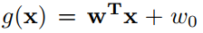

# ls-linear-discriminants
Least Squares Linear Discriminants

The object of this project is to build a linear classifier using the least squares criteria. A linear classification function can be written as:

where *x* is a sample data point, *w* is the weight vector or the normal of the separating hyperplane and *w0* is the threshold or bias.

In this project we will be given sets of positive and negative data (training data) and we are to build a linear classifier for the data by solving the minimum norm least squares problem for different choices of the **b** vector. The classifier that we have trained will then be tested or evaluated on the test data sets. The true test data labels will be provided from which we will report test error rates for each data set.

This was a MATLAB project for Special Topics in Machine Learning course at Shiraz University which was lectured by Dr. Hamed Masnadi-Shirazi back in Spring 2017 semester. The project guide is also included.
